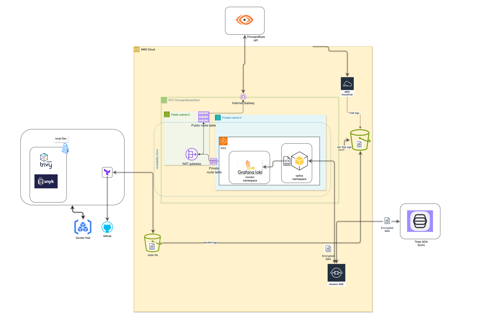

# ThousandEyes Optica Integration with Terraform, AWS, and Kubernetes


## Prerequisites

- **AWS Account**: You'll need an AWS account with appropriate permissions to create resources.
- **Terraform**: Download and install Terraform from [here](https://developer.hashicorp.com/terraform/tutorials).
- **AWS CLI**: Install the AWS CLI according to the instructions for your operating system: [AWS CLI Installation](https://docs.aws.amazon.com/cli/latest/userguide/getting-started-install.html)
- **Kubectl**: Install kubectl according to the instructions for your environment: [Kubectl Installation](https://kubernetes.io/docs/tutorials/kubernetes-basics/)
- **Text Editor**: Choose a text editor or IDE of your preference (e.g., VS Code, Sublime Text).

## Setting Up AWS Credentials

### Configure AWS Credentials:

1. Log in to the AWS Management Console and navigate to the IAM service.
2. Create a new user with programmatic access for Terraform.
3. Download the access key ID and secret access key for this user.

### Set Environment Variable:

```bash
export TF_VAR_account_id=<your_aws_account_id>
```
> Replace `<your_aws_account_id>` with your actual AWS account ID. You can add this line to your `~/.zshrc` or `~/.bashrc` file for permanent access or run it in your terminal before proceeding.

## Running Terraform

1. Initialize Terraform:

```bash
cd terraform
terraform init
```

2. Review and Apply Changes (Plan and Apply):

```bash
terraform plan
terraform apply
```

## ThousandEyes Configuration

1. Set ThousandEyes Bearer Token:


2. Update Secret:

- Within the AWS Management Console, navigate to the Secrets Manager service.
- Create a new secret named `thousandeyesbearer` and store your bearer token as the value.

## Deploying the Optica Application

1. Access the Namespace created from the service account deployment:

```bash
kubectl get namespaces
```

2. Apply Service Account and Deployment:

```bash
cd infrastructure/k8s
kubectl apply -f service_accounts.yaml
kubectl apply -n <namespace> -f optica.yaml
```

## Sending Messages to the Queue

1. Access the Queue sqs queue:


2. Send Initial Message:

```json
{"key": "tines", "body": "ready"}
```

3. Send Subsequent Messages:

- Choose one of the following messages to send:

```json
{"key": "tines", "body": "primary"}   # Use this to check default account
```

```json
{"key": "tines", "body": "12345"}     # Substitute with your ThousandEyes account group ID or other
```
